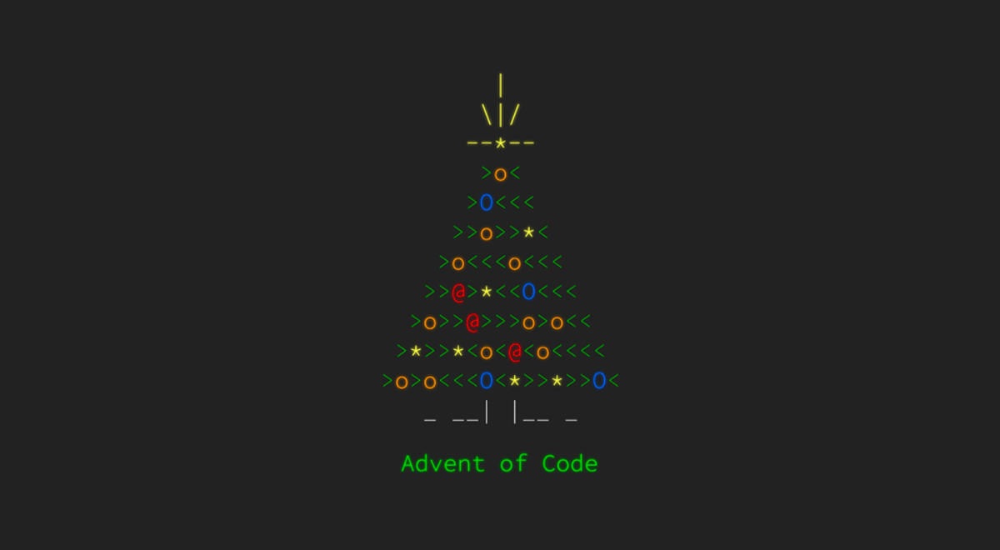

# Advent of Code Solutions

[](https://github.com/nikku/works-on-my-machine)
&nbsp;
[](https://github.com/matheusaraujo/advent-of-code/actions/workflows/tests.yaml)
&nbsp;
[](https://github.com/matheusaraujo/advent-of-code/actions/workflows/linting.yaml)


&nbsp;

&nbsp;




## Usage

```bash
# configure githooks
$ make configure-hooks

# install dependencies
$ make install

# create a new solution based on `day00` template
$ make create year=${YEAR} day=${DAY}

# test a specific day
# or `test-watch` for watch mode
# or `test-coverage` for coverage report
$ make test year=${YEAR} day=${DAY}

# validate (format, lint, test) a specific day
$ make validate year=${YEAR} day=${DAY}

# test everything
$ make test-all

# to see all available commands
$ make help
```

> A `session.cookie` plain text file on root directory (not versioned) is utilized to facilitate the automated download of the input file from https://adventofcode.com <br>
> This file must contain a valid session cookie obtained during a authenticated session on the Advent of Code website <br>
> Important Reminder: If the `session.cookie` file is missing, manual downloading of the input file is necessary.

## 2023

|   :christmas_tree:    |           2           |           0           |           2           |           3           |
| :-------------------: | :-------------------: | :-------------------: | :-------------------: | :-------------------: |
|         day25         |         day24         |         day23         |         day22         | [day21](/2023/day21/) |
|         day20         | [day19](/2023/day19/) | [day18](/2023/day18/) | [day17](/2023/day17/) | [day16](/2023/day16/) |
| [day15](/2023/day15/) | [day14](/2023/day/14) | [day13](/2023/day13/) | [day12](/2023/day12/) | [day11](/2023/day11/) |
| [day10](/2023/day10/) | [day09](/2023/day09/) | [day08](/2023/day08)  | [day07](/2023/day07/) | [day06](/2023/day06/) |
| [day05](/2023/day05/) | [day04](/2023/day04/) | [day03](/2023/day03/) | [day02](/2023/day02/) | [day01](/2023/day01/) |

## 2019

|   :christmas_tree:    |           2           |           0           |           1           |           9            |
| :-------------------: | :-------------------: | :-------------------: | :-------------------: | :--------------------: |
|         day25         |         day24         |         day23         |         day22         |         day21          |
|         day20         |         day19         |         day18         |         day17         |         day16          |
|         day15         |         day14         |         day13         |         day12         |         day11          |
|         day10         | [day09](/2019/day09/) | [day08](/2019/day08/) | [day07](/2019/day07/) | [day06](/2019//day06/) |
| [day05](/2019/day05/) | [day04](/2019/day04/) | [day03](/2019/day03/) | [day02](/2019/day02)  | [day01](/2019/day01/)  |

## 2015

|   :christmas_tree:    |           2           |           0           |           1           |           5           |
| :-------------------: | :-------------------: | :-------------------: | :-------------------: | :-------------------: |
|         day25         |         day24         |         day23         |         day22         |         day21         |
|         day20         |         day19         |         day18         |         day17         |         day16         |
|         day15         |         day14         |         day13         |         day12         |         day11         |
|         day10         |         day09         |         day08         |         day07         | [day06](/2015/day06/) |
| [day05](/2015/day05/) | [day04](/2015/day04/) | [day03](/2015/day03/) | [day02](/2015/day02/) | [day01](/2015/day01/) |
